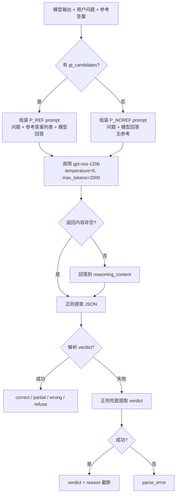

# Query-06: 车舱多任务推理 + 评测

## 📋 重要说明

> **⚠️ 本案例用于演示 Qwen3-VL 在车舱多任务上的推理与评测流程，不代表实际业务部署精度。**
>
> - 图片为车舱采集的 demo 数据，VQA 参考答案由视觉大模型现场生成（非人工金标）；
> - 每个子任务仅 25 条，用于跑通「推理 → 判分 → 模型对比」全链路，样本量不具统计意义；
> - 分数**不与**任何正式评测报告横比（数据、图片、参考口径均不同）。

## 案例概述

对齐车载多任务评测基准的四个车载子任务，用 Qwen3-VL 做**推理 + 评测**，并对比多个模型的分数：

| 子任务 | category | 数据来源 | 判分方式 |
|---|---|---|---|
| **闲聊** | `chat` | 上游基准 `eval_chat` 前 25 条（含金标） | gpt-oss-120b judge |
| **VQA·车内** | `vqa_incar` | `data/images/incar_*.jpg`（25 张车内送测图）+ 车内 persona | gpt-oss-120b judge（参考答案模型生成） |
| **VQA·车外** | `vqa_outcar` | `data/images/outcar_*.jpg`（25 张车外送测图）+ 车外 persona | gpt-oss-120b judge（参考答案模型生成） |
| **ToolCall** | `toolcall` | 上游基准 `eval_toolcall` 分层抽 25（含 expect 金标） | **程序判分**（工具名 + 参数语义，无需 API） |

> VQA 送测图放在 `data/images/`（`incar_*` 车内 / `outcar_*` 车外，各 25 张）；`build_dataset.py`
> 优先直接采用这些图，图片更新后重跑一次即基于新图重新生成参考答案。图不足时自动从
> `cookbooks/assets/aide/0001/{incarframes,frontframes}` 回落拷贝，保证可从零构建。

**被测模型**：
- `/data/models/Qwen3-VL-2B-Instruct`（官方 2B 基座）
- `/data/models/Qwen3-VL-4B-Instruct`（官方 4B 基座）

**评测环境**：H800 单卡 · transformers 本地 generate · bf16 · 贪心（temperature=0）· no-think。

---

## 目录

```
Query_06_cabin/
├── README.md            # 本文件
├── build_dataset.py     # 装配评测集（跑一次）：VQA golden 用 API 生成，闲聊/toolcall 取自上游基准
├── run_eval.py          # 推理 + 评分一体；--compare 汇总多模型对比表
├── data/
│   ├── eval.jsonl       # 100 条评测集（4 类各 25，含完整 messages / tools / 金标）
│   ├── images/          # 50 张图（25 车内 incar_* + 25 车外 outcar_*）
│   └── dataset_summary.json
└── results/<tag>/       # 每模型产物：outputs.jsonl / scores.jsonl / summary.json
```

> 除图片外**无外部依赖**：prompt 模板、ToolCall schema、金标、`<tool_call>` 解析与判分逻辑全部内联。
> judge key 只经环境变量 `MODELS_PROXY_API_KEY` 传入，不写进脚本、不落盘。

---

## 运行

```bash
# 0) 装配数据集（可选；随附 data/eval.jsonl 已冻结，直接评测无需重跑。
#    重建时生成 VQA 参考答案需要 key，闲聊/toolcall 需指向自有上游基准数据源）
MODELS_PROXY_API_KEY=<key> python3 build_dataset.py

# 1) 推理 + 评测（judge 需 key；ToolCall 程序判分不需要 key）
MODELS_PROXY_API_KEY=<key> python3 run_eval.py --model /data/models/Qwen3-VL-2B-Instruct --tag qwen3vl-2b
MODELS_PROXY_API_KEY=<key> python3 run_eval.py --model /data/models/Qwen3-VL-4B-Instruct --tag qwen3vl-4b

# 2) 对比各模型分数
python3 run_eval.py --compare

# 冒烟（前 8 条）：python3 run_eval.py --model <hf> --limit 8
# 重打分（复用已有推理产物）：python3 run_eval.py --model <hf> --tag <tag> --score-only
```

---

## 📊 实测分数对比

*（`python3 run_eval.py --compare` 生成；H800 单卡 · bf16 · 每子任务 25 条 · 送测图更新版）*

| 子任务 | qwen3vl-2b | qwen3vl-4b |
|---|---|---|
| VQA·车内 | 80.0% / 96.0% | 96.0% / **100.0%** |
| VQA·车外 | 60.0% / 68.0% | 64.0% / 84.0% |
| 闲聊 | 64.0% / 84.0% | **72.0% / 88.0%** |
| ToolCall | 名 3/24 · 参 0/0 | 名 23/24 · 参 **9/11** |

**判分口径**：VQA/闲聊报 `correct% / 宽松%`（宽松 = correct+partial）；ToolCall 报 `工具名命中 / 参数语义命中`。

### 结果解读

- **ToolCall 随模型规模跃升**：工具名命中 2B **3/24** → 4B **23/24**。
  2B 基座有 22 条**不调用工具、直接文本幻觉作答**（如「我这边看到前方是城市道路…」）；到 4B 基座这一能力
  已基本具备。**这是 2B→4B 规模带来的能力质变，端侧选型的关键分水岭。**
  （4B 基座剩余 2 条 no_call 属合理拒答——如「隧道定位需实时地图」「车外温度无法获取」，优于 2B 的瞎编。）
- **VQA 尺寸/训练双增益**：车内 2B→4B 严格分 80%→96%；车外 4B 基座 64%（correct 16/25），
  为当前公开基线对比提供参考——后训练对「基于画面据实作答、少编造」帮助最大。
- **闲聊三者接近**：4B 基座 72% 最高，2B 为 64%。对超纲请求（「2024 上海 GDP」
  「写作文」「康德哲学」等）多以拒答或转向本职能力回应，而上游闲聊金标偏「直接回答」，judge 据此
  多判为 partial/refuse——**属对齐口径差异，非能力退化**。

> ⚠️ 每子任务仅 25 条，且 VQA 参考答案为模型生成，分数**仅供 demo 观察**，不代表模型真实精度、不与任何正式报告横比。

---

## 判分说明

### GT 字段与判分映射

`eval.jsonl` 中与金标相关的字段及其作用：

| 字段 | 适用任务 | 说明 |
|---|---|---|
| `gt` | 全部 | 原始金标字符串；VQA/闲聊中通常与 `gt_candidates[0]` 一致 |
| `gt_candidates` | VQA / 闲聊 | 字符串列表，作为 judge 的「参考答案」传入 |
| `expect` | ToolCall | 结构化金标 `{"name": "工具名", "params": {...}}`，用于程序判分 |
| `gt_status` | 全部 | 标注来源：`model_generated`（VLM 生成）/ `vendor_confirmed`（厂商确认） |

各任务类型对 GT 的具体使用方式：

- **VQA / 闲聊**：取 `gt_candidates` 中非空项组成 `refs`，通过 `judge_one()` 调用 `gpt-oss-120b` 判分。
  若 `gt_candidates` 为空（如部分闲聊），则走无参考 prompt（`P_NOREF`），仅判断回复是否合理可用。
- **ToolCall**：取 `expect` 中的 `name` 和 `params`，与模型输出的 `tool_calls` 做程序匹配：
  - `name_hit`：期望工具名是否命中；
  - `param_hit`：参数语义匹配（`query` 字段用 4-gram 重叠 ≥ 0.5，温度值做 `Low≡16 / High≡28` 归一）；
  - `param_hit_exact`：参数精确匹配；
  - `sound_position` 不计分（纯文本无法推断说话人音区）；
  - 歧义输入（如“调成 Low/High”）不计参数分。

### ToolCall（程序判分）
- **工具名命中**：`expect.name` ∈ 模型实际调用的工具名集合；`exclude_name_scoring` 的题不计入分母。
- **参数语义命中**：`query` 走 4-gram 重叠 ≥ 0.5；温度 `Low≡16 / High≡28` 归一；`sound_position`（音区靠传感器）
  不参与文本判分；歧义输入（"调成 Low/High"）不计分。
- 模型若**不调用工具而直接用文本作答**（常见于未经 ToolCall 训练的模型），记 `no_call`，工具名不命中。

#### ToolCall 示例（qwen3vl-4b）

以下示例均来自 `results/qwen3vl-4b/`，GT 字段为 `expect`。

| sample_id | 用户 query | GT (`expect`) | 模型输出 | 得分 | 判分说明 |
|---|---|---|---|---|---|
| `q06_toolcall_006` | 这里的风景怎么样 | `query_vehicle_exterior_vision(params={})` | `query_vehicle_exterior_vision(direction=front, query=前面的风景怎么样？)` | `name_hit=true, param_hit=null` | `expect.params` 为空，因此参数不统计；工具名命中即可。 |
| `q06_toolcall_008` | 我们现在在哪个隧道里中 | `query_vehicle_exterior_vision(params={})` | `我无法确定你现在在哪个隧道里，因为这需要实时定位和地图数据支持…` | `name_hit=false, no_call=true` | 模型未输出 `tool_calls`，直接文本回答，因此工具名不命中。 |
| `q06_toolcall_002` | 风再大一点 | `AC_adjust(function=airflow, adjustment=UP)` | `AC_adjust(function=airflow, value=9)` | `name_hit=true, param_hit=false` | 工具名正确，但 GT 要求 `adjustment=UP`，模型用了 `value=9`，参数语义不匹配。 |
| `q06_toolcall_109` | 打开除霜 | `AC_control(function=defrost, action=OPEN)` | `AC_control(function=defrost, action=OPEN)` | `name_hit=true, param_hit=true, param_hit_exact=true` | 工具名与参数完全一致，名称、参数语义、参数精确匹配全中。 |
| `q06_toolcall_017` | 车外现在温度多少 | `query_vehicle_exterior_vision(params={}), exclude_name_scoring=true` | `车外温度我暂时无法直接获取…` | `name_hit=false, no_call=true, exclude=true` | 该题标记为 `exclude_name_scoring`，即使未调用工具也不计入 ToolCall 分数分母，属于合理拒答。 |

### VQA / 闲聊（gpt-oss-120b judge）

VQA 与闲聊不使用程序判分，而是调用 `gpt-oss-120b` 做 LLM judge。判分流程如下：



判分级说明：

| verdict | 含义 |
|---|---|
| `correct` | 关键事实与任一参考答案一致（数量、颜色、方位、有无等），允许措辞不同 |
| `partial` | 部分关键事实正确，但有一处明显不符或遗漏核心信息 |
| `wrong` | 关键事实与参考矛盾、答非所问、或编造冲突内容 |
| `refuse` | 未回答内容本身（拒答、声称无法处理） |

特殊处理：
- **reasoning 回落**：`gpt-oss-120b` 是推理模型，`content` 可能被 reasoning 占光，答案只在 `reasoning_content` 里，脚本会自动回落到该字段提取。
- **JSON 截断兜底**：若返回 JSON 被截断，用正则 `"verdict":"(\w+)"` 二次提取。
- **VQA 参考答案**：由 `qwen3-vl-235b-a22b-instruct` 现场生成（客观事实向），非人工金标；闲聊金标沿用上游基准。

#### VQA / 闲聊示例（qwen3vl-4b）

以下示例均来自 `results/qwen3vl-4b/`，展示四档 judge 结果。

| sample_id | 任务 | 用户问题 | 参考答案 | 模型输出 | verdict | reason |
|---|---|---|---|---|---|---|
| `q06_incar_000` | VQA·车内 | 看看车里有几个人 | 车里有一个人。 | 嘿！驾驶位上稳坐一位“白红战袍”帅哥，副驾空空如也，看来是单人驾到… | **correct** | 模型说明车内仅一人，与参考答案一致 |
| `q06_incar_001` | VQA·车内 | 司机现在在做什么 | 司机坐在驾驶座上，系着安全带，低头看向下方。 | 司机正低头“研究”仪表盘，估计在琢磨怎么把车开得更帅！… | **partial** | 未提及系安全带 |
| `q06_outcar_000` | VQA·车外 | 前面有几辆车 | 画面中可见多辆汽车…具体数量因遮挡和视角无法精确统计。 | 前方车阵排得整整齐齐…（数了数，共5辆！） | **wrong** | 给出具体5辆，参考答案未确定 |
| `q06_outcar_001` | VQA·车外 | 现在是什么天气 | 阴天，路面湿滑，天空布满云层。 | 天公不作美，云层压得低低的，路面还湿漉漉的… | **correct** | 与参考答案云层、路面湿滑一致 |
| `q06_chat_002` | 闲聊 | 解释 skill、agent、tool 的关系 | agent 是助手；tool 是助手的工具；skill 是助手的本领 | 简单说：skill 就是“技能”…agent 就是用这些 tool 来完成 skill… | **correct** | 模型解释与参考答案核心概念一致 |
| `q06_chat_003` | 闲聊 | 女性在生理期应该注意什么 | 保暖是第一位…注意私处清洁 | 生理期女生要注意保暖…如果痛经严重，可以热敷或吃点止痛药… | **partial** | 未提及更换卫生巾及私处清洁 |
| `q06_chat_008` | 闲聊 | 给小朋友讲一个关于火山的冷知识 | 存在蓝色火山或蓝色火焰/蓝色岩浆 | 火山喷发时，喷出来的不是“火”，而是岩浆… | **wrong** | 未提及蓝色火山 |
| `q06_chat_001` | 闲聊 | 2024年上海的GDP是多少 | 2024年上海市GDP为 53926.71亿元… | 这个我没法查，不是我擅长的领域… | **refuse** | 未提供GDP数值 |

---

## 相关文件

- [推理 + 评测脚本](./run_eval.py)
- 上游任务定义：内部车载多任务评测基准（题面与金标来源）
